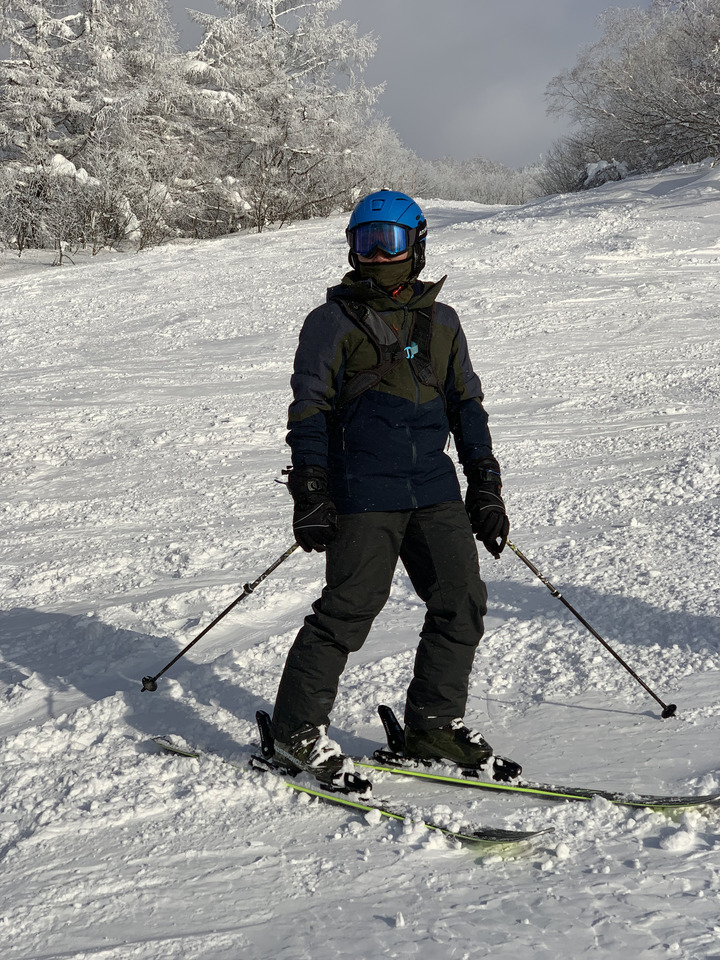

# vincentliao_sky

眼睛看書玩攝影，嘴巴品咖啡吃美食，左手烤麵包，右手弄園藝，雙腳滑雪騎車爬山又跑步的工程師：Vincent Liao。

基於 [Jason Labbe](https://openprocessing.org/user/60876) 的 [ Voronoi portrait](https://openprocessing.org/sketch/479353)，邀請一些人來同樂。
每個人提供了一張照片與一段留言，我調整了程式碼，給每一張照片一組 hotspots 的起始值。
最後就是集眾人之力，成就了一個 photo gallery in voronoi diagrams 的 photo gallery。

Demo 請見 [GitHub Page](https://drakeguan.github.io/vincentliao_sky/)。

## 如何參與？

- 準備一張照片，建議在 960x960 的大小之內 (沒有任何原因)。
- 準備一段文字，建議比一則 tweet 還短 (如果你不曉得什麼是 tweet，那就是文字少於 140 個字，甚至少於 100 個字更好的意思)。
- Folk 這個 repo。
- 把你的圖片命名好，放進 `images/` 目錄下。
- 在 `tribute_data.json` 檔裏頭 (有樣學樣) 新增一筆，主要的欄位就 `name`, `photo`, `message`。
- 發一個 PR 過來。
- 我會盡快接受你的 PR，這樣你就也跟著加入，可以在上述的 GitHub Page 裏頭看到了。

## ToDo

- Mobile-friendly font size and alignment;
- Animation of hotspots transformation between photos;
- Less voronoi-blurry fallout;
- Other visual effects to play for;
